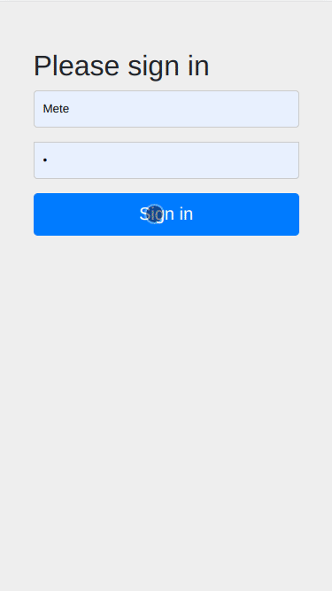
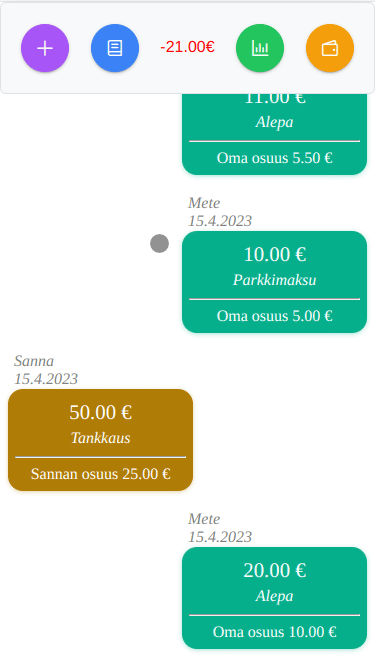
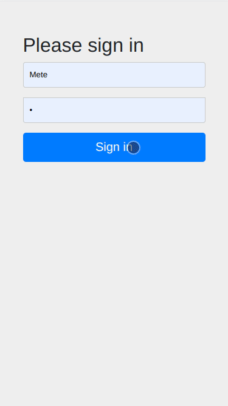

# Weshare

- App for splitting bills between 2 users.
- Built with Spring Boot (Java 21) / Angular 18 / Flyway / PostgreSQL.
- Runs in browser and is styled just enough to look good with my current phone.
- I built this because MobilePay discontinued their own app Weshare at the start of 2023. This app is intended for my personal use only as it is hardcoded for 2 people but feel free to do whatever you want with it.
- Using this repository to try out Testcontainers for integration tests and local development.

# Table of Contents

- [Installation](#installation)
- [Start the app](#start-the-app)
  - [1. Recommended way (Testcontainers)](#1-recommended-way-testcontainers)
  - [2. Containerized database way](#2-containerized-database-way)
  - [3. Local database way](#3-local-database-way)
- [Resetting database](#resetting-database)
- [Features](#features)
  - [Create bills](#create-bills)
  - [Show added bills](#show-added-bills)
  - [Pay debt](#pay-debt)
- [Extra](#extra)
- [TODO](#todo)

# Installation

Prerequisites:

| Requirement     | Details                                                                                           |
|-----------------|---------------------------------------------------------------------------------------------------|
| Java 21         | ✅ **Required**                                                                                    |
| Maven           | 🛠️ Not needed if using the **Maven Wrapper** provided in the project                             |
| Node.js         | 🛠️ Not needed if using the local Node.js installation in the project                             |
| PostgreSQL      | 🛠️ Not needed if using the containerized setup                                                   |
| Docker / Podman | 🔄 Optional but **recommended** for running containers                                            |


```sh
# Running this will install maven dependencies
# Maven build process also installs node locally to this project and npm dependencies in `/client` directory
cd server && ./mvnw spring-boot:test-run
```

# Start the app

Users to login with after the application is running:
- **User 1:**
  - Username: `user`
  - Password: `password`
- **User 2:**
  - Username: `user2`
  - Password: `password`

The app can be started in three ways:

### 1. Recommended way (Testcontainers)

---
This is the easiest setup, requiring only Docker-daemon to be running. It will start Spring Boot & PostgreSQL in a container.

```sh
cd server && ./mvnw spring-boot:test-run
```
```sh
cd client && npm start
```
- Navigate to http://localhost:8080

### 2. Containerized database way

---
Spring Boot, Angular and containerized database.

- Run `docker-compose up -d` in project root.
```sh
cd server && ./mvnw spring-boot:test-run
```
```sh
cd client && npm start
```
```sh
# Insert test data
docker exec -i weshare_db psql -U postgres -d weshare -f /create-test-data.sql
```
- Navigate to http://localhost:8080

### 3. Local database way

---
This is same as 'Containerized database way' but with local installation of PostgreSQL

- Create database with the name `weshare`
- Change `spring.datasource.url` in `application-dev.properties` to the port your database instance is running on.
```sh
cd server && ./mvnw spring-boot:test-run
```
```sh
cd client && npm start
```
```sh
# Insert test data
psql -U postgres -d weshare -f server/src/main/resources/db/create-test-data.sql
```
- Navigate to http://localhost:8080

# Resetting database

## Using Testcontainers:
  1. Delete the container with normal Docker commands
  2. Restart app

## Using Container Database:
```sh
docker-compose down -v && docker-compose up -d 
```
```sh
cd server && ./mvnw spring-boot:run -Dspring-boot.run.profiles=dev
```
```sh
docker exec -i weshare_db psql -U postgres -d weshare -f /create-test-data.sql
```

## Using Local Database:
```sh
cd client && npm run resetLocalDB
```
```sh
cd server && ./mvnw spring-boot:run -Dspring-boot.run.profiles=dev
```
```sh
psql -U postgres -d weshare -f server/src/main/resources/db/create-test-data.sql
```
---

# Features

Six features have been implemented, with their implementation and preview statuses outlined below:

| Feature          | Implemented | Preview Recorded |
|------------------|-------------|------------------|
| Create bills     | ✅           | ✅                |
| Show added bills | ✅           | ✅                |
| Pay debt         | ✅           | ✅                |
| Edit bills       | ✅           | ❌                |
| Delete bills     | ✅           | ❌                |
| Show statistics  | ✅           | ❌                |

## Create bills



## Show added bills



## Pay debt



# Extra

For production optimized .jar run `./mvnw clean package` in `/server` directory.

# TODO:
- Add GIFs for all implemented features
- Support for more than 2 users
- Implement more tests
- Internationalization and localization

---
