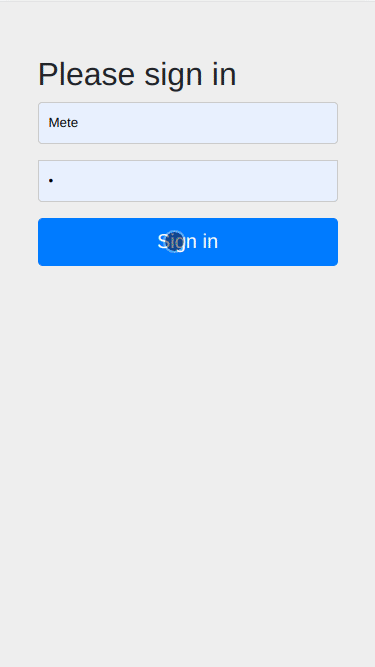
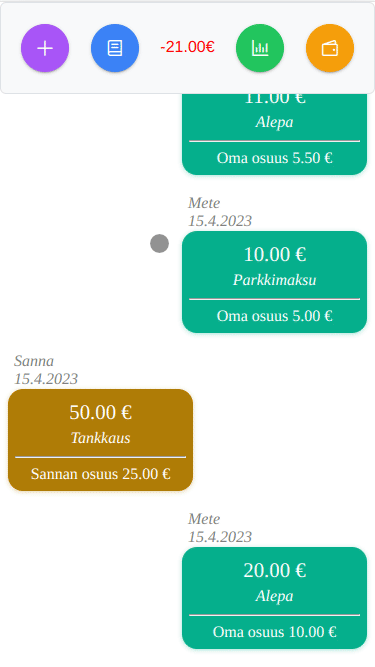
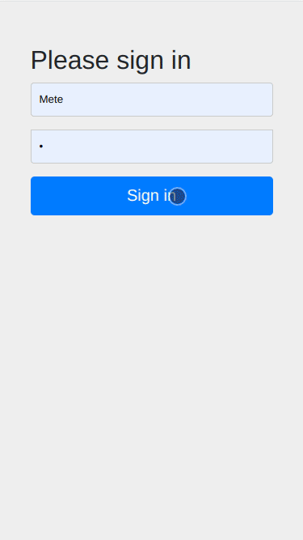

# Weshare

<p>App for splitting bills fairly.</p>
<p>Built with Spring Boot / Angular 14 / MongoDB Atlas.</p>
<p>Runs in browser and is styled just enough to look good with my current phone.</p> 
<p>App was built because Mobilepay discontinued their own app Weshare at the start of 2023. This app was intended for my personal use only as it is hardcoded for 2 people but feel free to do whatever you want with it.</p>

---

# Usage

## Create bills

- Set amount
- Set own amount of the bill
- Write description
- Set category
- Save

  

## Show bills

- Scroll added bills from last 6 months
- Look statistics about bill amounts from bar chart

  

## Pay debt

- Pay accumulated debt

  

---

# Installation

## Prequisites

- [MongoDB Atlas](https://studio3t.com/knowledge-base/articles/connect-to-mongodb-atlas/) for database.
- Java 17
- Maven

## Instructions for setting up local environment

- Clone repository normally
  <br>

### Spring boot configuration

- Create file <b>application-dev.properties</b> to folder <code>weshare-api/main/resources</code>. Example content for
  this file is found in <code>weshare-api/application.properties.example</code>
- Minimum required properties are:

```*.properties
  spring.data.mongodb.uri=mongodb+srv://exampleUser:<password>@<MongoURL>?retryWrites=true&w=majority
  spring.data.mongodb.database=<collectionName>
  Role1=RoleName1
  Role2=RoleName2

```

### Angular configuration

- Run <code>npm install</code> inside <code>/weshare-ui</code> directory
- Check the available npm scripts in <b>package.json</b>

### Set up database

- Easy to follow [instructions](https://fullstackopen.com/en/part3/saving_data_to_mongo_db) to set up MongoDB Atlas
- Create cluster in MongoDB Atlas
- Add MongoURL to <b>application-dev.properties</b>

### Add users to database

- This app uses Spring Security for managing login. It checks for username and password that are stored in MongoDB. Also the api routes are authorized to certain roles only.
- Follow instructions on <code>weshare-api/src/main/java/com/weshare/GenerateBills.java</code> to generate users to login with.

---

## Start the app

- Before starting the app make sure you have configured required values to <b>application-dev.properties</b>
- To start the app type <code>npm run bdev</code> inside <code>/weshare-ui</code> directory. This does 3 things

  - Builds Angular files to Spring folder <code>src/main/resources/static</code>
  - Runs <code>mvn clean package</code> that builds the .jar file
  - Runs .jar file with profile=dev (for spring boot). You should have <b>application-dev.properties</b> set up for
    this reason.

- If everything went ok app should be running in <code>http://localhost:8080</code>
- For production optimized .jar just run <code>npm run bprod</code>
